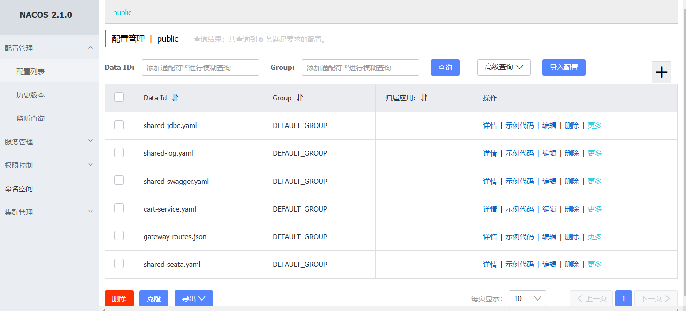

- `shared-jdbc.yaml`: jdbc的配置文件

  ```yaml
  spring:
    datasource:
      url: jdbc:mysql://${hm.db.host:192.168.244.130}:3306/${hm.db.database}?useUnicode=true&characterEncoding=UTF-8&autoReconnect=true&serverTimezone=Asia/Shanghai
      driver-class-name: com.mysql.cj.jdbc.Driver
      username: ${hm.db.un:root}
      password: ${hm.db.pw:123456}
  mybatis-plus:
    configuration:
      default-enum-type-handler: com.baomidou.mybatisplus.core.handlers.MybatisEnumTypeHandler
    global-config:
      db-config:
        update-strategy: not_null
        id-type: auto
  ```

- `shared-log.yaml`: 日志共享配置

  ```yaml
  logging:
    level:
      com.hmall: debug
    pattern:
      dateformat: HH:mm:ss:SSS
    file:
      path: "logs/${spring.application.name}" # 生成的日志文件
  ```

- `shared-swagger.yaml`: 共享的swagger配置

  ```yaml
  knife4j: # 丝袜哥配置 api文档
    enable: true
    openapi:
      title: ${hm.swagger.title:黑马商城接口文档}
      description: ${hm.swagger.desc:黑马商城接口文档}
      email: zhanghuyi@itcast.cn
      concat: 汐
      url: https://www.itcast.cn
      version: v1.0.0
      group:
        default:
          group-name: default
          api-rule: package
          api-rule-resources:
            - ${hm.swagger.package}
  ```

- `cart-service.yaml`: 购物车的配置文件 商品数量上限

  ```yaml
  hm:
    cart:
      maxItems: 4 # 购物车商品数量上限
  ```

- `gateway-routers.json`: 网关路由信息

  ```yaml
  [
      {
          "id": "item",
          "predicates": [{
              "name": "Path",
              "args": {"_genkey_0":"/items/**", "_genkey_1":"/search/**"}
          }],
          "filters": [],
          "uri": "lb://item-service"
      },
      {
          "id": "cart",
          "predicates": [{
              "name": "Path",
              "args": {"_genkey_0":"/carts/**"}
          }],
          "filters": [],
          "uri": "lb://cart-service"
      },
      {
          "id": "user",
          "predicates": [{
              "name": "Path",
              "args": {"_genkey_0":"/users/**", "_genkey_1":"/addresses/**"}
          }],
          "filters": [],
          "uri": "lb://user-service"
      },
      {
          "id": "trade",
          "predicates": [{
              "name": "Path",
              "args": {"_genkey_0":"/orders/**"}
          }],
          "filters": [],
          "uri": "lb://trade-service"
      },
      {
          "id": "pay",
          "predicates": [{
              "name": "Path",
              "args": {"_genkey_0":"/pay-orders/**"}
          }],
          "filters": [],
          "uri": "lb://pay-service"
      }
  ]
  ```

- `shared-seata.yaml`: seata的客户端配置

  ```yaml
  seata:
    registry: # TC服务注册中心的配置，微服务根据这些信息去注册中心获取tc服务地址
      type: nacos # 注册中心类型 nacos
      nacos:
        server-addr: 192.168.244.130:8848 # nacos地址
        namespace: "" # namespace，默认为空
        group: DEFAULT_GROUP # 分组，默认是DEFAULT_GROUP
        application: seata-server # seata服务名称
        username: nacos
        password: nacos
    tx-service-group: hmall # 事务组名称
    service:
      vgroup-mapping: # 事务组与tc集群的映射关系
        hmall: "default"
    # data-source-proxy-mode: XA # 告诉seata我们用XA模式
    data-source-proxy-mode: AT # 告诉seata我们用AT模式 不指定默认就是AT
  ```

  